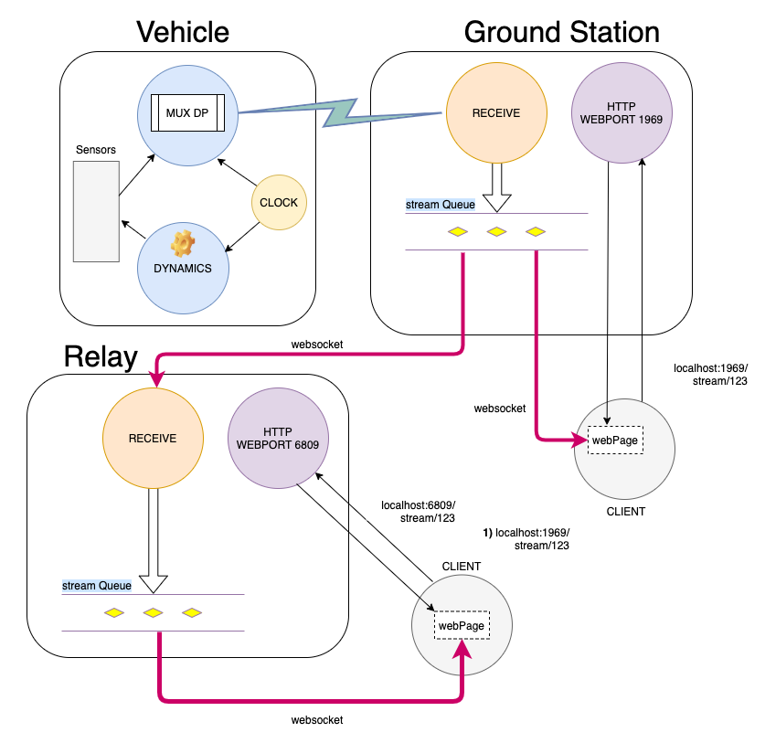

# DAQ (still WIP)
Daq provides a possible solution to package and transmit data from a vehicle to a fixed station. The station captures the data and passed it along to client applications for consumption. Clients connect to the ground station using an _authentication token_ to start receiving the stream of data.

This system could be used for any type of vehicle that requires a form of data transmission with a static station.


### Vehicle
In this simulation, the dynamics of a rocket launch is used to generate the data. This data is collected by a daemon subroutine that wakes up at regular time intervals. Data points containing critical rocket information are multiplexed in data packets and sent to a ground station. Clients connected to the ground station receive the data through a permanent **_websocket_** connection allowing for "**realtime data processing**". As the data is coming to the client, it can be used to visualize and evaluate how the vehicle is performing -or- can be logged for later processing.


### Data format
To avoid unecessary overhead in packaging payload with _marhsalling / unmarshalling_ techniques, the data is always sent in binary form. It is received as an array of bytes and then casted appropriately based on the nature of its content.  


### Data point
Each data point consists of a 16 bytes buffer containing a data point Id and, depending on the data point, a combination of values held on 4 bytes (int32, uint32, float32).  


### Data packet
A data packet is a set of data points put together and send to the ground station as a whole. Each data packet contains a 16 bytes header holding information pertaining to its payload. To make sure no error occurred during transmission, a CRC32 is calculated on the payload only and stored in the header's packet before sending it. In addition to the CRC32 value, a timestamp and the number of data points stored in the payload complete the header section:

```text
offset  0:  packet marker
offset  2:  32bits CRC calculated on the payload only
offset  6:  the number of data points in this packet
offset  7:  the timestamp on 64bits
offset 15:  1 reserved byte
```

A data packet payload has a default length of 256 bytes and therefore can hold up to 256 / 16 = **16** data points.
Since the vehicle needs to send more data points than a packet can hold, the vehicle data muxer will automatically take care of breaking down the set of data points across multiple packets. It is also possible to create longer packets to hold more data points by changing the value of the constant **PACKET_PAYLOAD_LENGTH** to a multiple of 256 in the file _daq/packages/data/packet.go_.


### Ground station
The ground station has 3 functions:
- Make sure there was no error in the data received from the vehicle (comparing CRC32 calculated and CRC32 transmitted). 
- Place the set of data points received to its streaming queue.
- Accept connection requests from clients to allow them to access the data stream. When connecting, clients have the choice to access the stream from its most recent data, or from its oldest (TBI). The ground station maintain a list of connected clients and manage that list as clients connect or disconnect. A client is known in the list by an auto generated client token value obtained during the establishment of the websocket connection.


# Visualize the data coming from the vehicle


To create the simulation, you will need to run 2 processes:
- the _groundstation_ process
- the _vehicle_ process  

These processes do not need to run on the same CPU. If you try to run them on 2 different computers, make sure to update in the _daq/packages/data/types.go_ file the downlink server string constant **DOWNLINK_SERVER** with the proper network address, so that the vehicle can reach the ground station.


### 1 - Start the ground station
Go to daq/cmd/groundstation and type:
```bash
> go build
```
and then
```bash
> ./groundstation
```
This will make the ground station listen for data on its downlink with the vehicle, and also listen for clients to connect to its streaming queue.


### 2 - Connect a client to the ground station
A javascript client example is provided. It can be run from a web browser by typing in the address bar:
```
localhost:1969/stream/123
```
- *1969* is the default web port from which you can request a connection 
- *123* is the authentication token you must provide to access the service. The authentication is super minimalistic as it is not the main goal of this project.

Alternately, you can also use a less crude interface by typing:
```
localhost:1969/test/123
```
which also provides the flight path angle and better graphics.

You should get a static looking page showing you some blank values, as the vehicle hasn't launched yet.


### 3 - Launch the rocket
Go to daq/cmd/downlink/launch and type:
```bash
> go build
```
and then
```bash
> ./launch
```

As the vehicle code starts crunching data, the downlink data Muxer goroutine wakes up every 10 milliseconds to read critical variables values (sensors) and packages them into data points. When there are enough data points to fill a packet, a CRC32 is calculated on the data points only and saved in the packet header, along with the current time and the number of data points in the packets. The packet is then sent to the ground station.

From now on, you should see data coming to your client.





# Scaling


### Relay
The diagram shows a third component not mentioned yet: **_the Relay_**. The relay isn't necessary for the data flow to work. It is simply a way to _scale_ the ground station by creating duplicates of the streaming queue and allow new clients to connect to the relay instead of the ground station directly. 

The relay code is essentially the same as the ground station except that it doesn't listen for data on the downlink. Instead, it relies on a websocket connection with the ground station just as any another client would. The relay has its own streaming queue on which the ground station oncoming data is written to. Clients connect to the relay using the same syntax as for the ground station, but with a variation in webport values.

To start the groundstation code as a relay:
```bash
> ./groundstation -r localhost -wp 6809
```
Command flags:
- -r : Relay server ip
- -wp: web port used by clients to access the relay

This will start a relay on _localhost:6809_ and allow web client to connect to it using the request:
```
http://localhost:6809/stream/123
```

### Note
The current code assumes that relay and ground station operate using the same domain name as the server network address specified after the -r flag is used to connect to the ground station too. 


### Future improvement
Instead of adding more flags to the command line to include more functionalities, a better approach could be to have only one **-f** parameter followed by a _configuration file_ that would contain all the required information for the relay to properly connect to the ground station.
