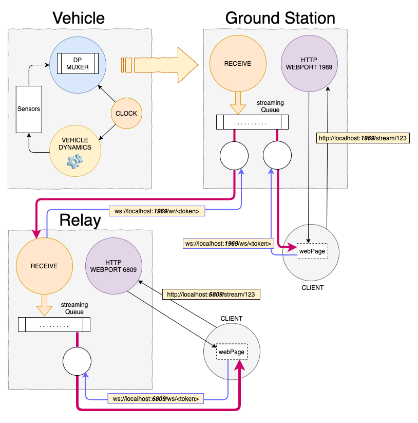

# daq
Daq is an attempt to evaluate how data generated during a rocket launch can be captured and processed with the help of a ground station (it could be any type of vehicle that requires a form of data transmission). The ground station, in turn, streams the data to clients that connect to it using an authentication token.


### Vehicle
In this simulation, the dynamics of a rocket launch is used to generate the data. This data is sent to a ground station that has any number of clients connected to it. Clients are receiving the data through a permanent websocket connection allowing for "realtime data processing". As the data is coming to the client, it can be used to visualize what the vehicle is doing -or- can be logged for later processing.


### Data format
To avoid unecessary overhead in packaging payload with _marhsalling / unmarshalling_ techniques, the data is always sent in binary form. It is received as an array of bytes and then casted appropriately based on the nature of its content.  


### data point
Each data point consists of a 16 bytes buffer containing a datapoint Id and, depending on the datapoint, a combination of values held on 4 bytes (int32, uint32, float32).  


### data packet
A data packet is a set of datapoints put together and send to the ground station as a whole. Each data packet contains a 16 bytes header holding information pertaining to its payload. To make sure no error occurred during transmission, a CRC32 is calculated on the payload only and stored in the header's packet before sending it. In addition to the CRC32 value, a timestamp and the number of datapoints stored in the payload complete the header section:

```text
offset  0:  packet marker
offset  2:  32bits CRC calculated on the payload only
offset  6:  the number of datapoints in this packet
offset  7:  the timestamp on 64bits
offset 15:  1 reserved byte
```

A data packet has a default length of 256 bytes and therefore can hold up to (256/16) - 1 = **15** datapoints.
If the vehicle needs to send more datapoints than a packet can hold, the vehicle data muxer will automatically take car of breaking down the whole set of datapoints though multiple packets. Of course, it is also possible to create longer packets to hold more datapoints.


### Ground station
The ground station has 3 functions:
- Make sure there were no error in the data received from the vehicle (comparing CRC32 calculated and CRC32 transmitted). 
- Place the set of datapoints received to its streaming queue.
- Accept connection requests from clients to allow them to access the streaming data. When connecting, clients have the choice to access the stream from its most recent data, or from its oldest data (TBI). 


# Visualize the data coming from the vehicle


To create the simulation, you will need to run 2 processes:
- the _groundstation_ process
- the _vehicle_ process  

These processes do not need to run on the same CPU. If you try to run them on 2 different computers, make sure to update the downlink server string (in the daq/packages/data.go file) with the proper network address, so that the vehicle can reach the ground station.


### 1 - Start the ground station
Go to daq/cmd/groundstation and type:
```bash
> go build
```
and then
```bash
> ./groundstation
```
This will make the ground station listen for data on its downlink with the vehicle, and also listen for clients to connect to its streaming queue.


### 2 - Connect a client to the ground station
A javascript client example is provided. It can be run from a web browser by typing in the address bar:
```
localhost:1969/stream/123
```
- *1969* is the default web port from which you can request a connection 
- *123* is the authentication token you must provide to access the service.

You should get a static looking page showing you some blank values, as the vehicle hasn't launched yet.


### 3 - Launch the rocket
Go to daq/cmd/downlink/launch and type:
```bash
> go build
```
and then
```bash
> ./launch
```

As the vehicle code starts crunching data, the downlink goroutine wakes up every 10 milliseconds to read critical variables values (sensors) and packages them into datapoints. When there are enough datapoints to fill a packet, a CRC32 is calculated on the datapoints only and saved in the packet header, along with the current time and the number of datapoints in the packets. The packet is then sent to the ground station.

From now on, you should see data coming to your client.





# Scaling


### Relay
The diagram shows a third component not mentioned yet: **_the Relay_**. The relay isn't necessary for the data flow to work. It is simply a way to _scale_ the ground station by creating duplicates of the streaming queue and allow new clients to connect to the relay instead of the ground station directly. 

The relay code is essentially the same as the ground station except that it doesn't listen for data on the downlink. Instead, it relies on a websocket connection with the ground station just as any another client would. The relay has its own streaming queue on which the ground station oncoming data is written to. Clients connect to the relay using the same syntax as for the ground station, but with a variation in webport values.

To start a relay:
```bash
> ./groundstation -r localhost -wp 6809
```

This will start a relay and allow web client to connect to it using the request:
```
http://localhost:6809/stream/123
```

### Note
```
The current code assumes that relay and ground station operate using the same domain name. 
```
