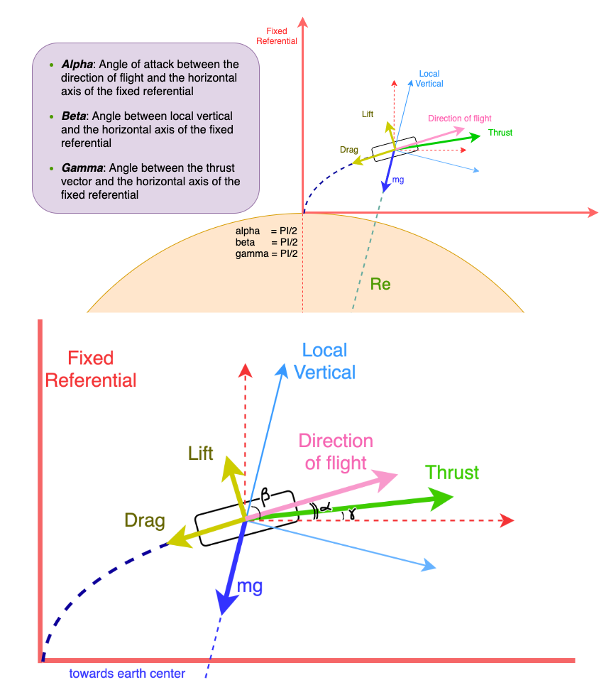

# The Physics of the rocket launch simulation
The excellent [Spx](https://github.com/decmurphy/Spx) repo from Declan Murphy was used as a base for creating the data generated during a rocket launch.



### Basis
The rocket coordinates, velocity and acceleration are all calculated with respect to the fixed referential set at the launch location.

### Steps
Knowing the initial conditions and the equations that determine the trajectory, we can calculate acceleration, velocity and position by injecting a time *_dt_* in each iteration of these calculations.

### equations
To calculate these various quantities, we first need to determine what forces are involved in the fixed referential x and y directions.

- x direction:
```text
Fx = - D * cos(alpha) - m * g * sin(beta) + T * cos(gamma)
Where 
- D is the drag
- m is the rocket mass
- g is the acceleration of gravity at this altitude
- T is the thrust
```
Note that all these parameters are a function of time and will have to be calculated before being used in the equation. Also, the lift L has been ignored (which assumes that the Thrust follows the flight path). In other words gamma = alpha. 


- y direction:
```text
Similarly
Fy = - D * sin(alpha) - m * g * cos(beta) + T * sin(gamma)
```
Once the force components are known, The acceleration can be calculated:

- Ax:
```text
Ax = Fx / m
```

- Ay:
```text
Ay = Fy / m
```

