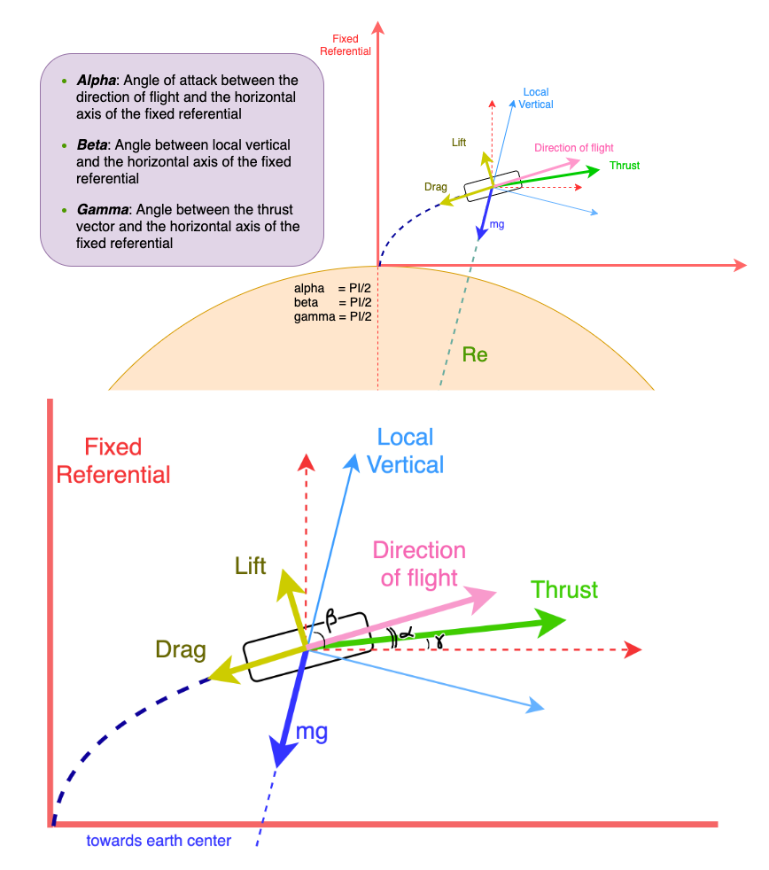

# The Physics of the rocket launch simulation
The excellent [Spx](https://github.com/decmurphy/Spx) repo from Declan Murphy was used as a base for creating the data generated during a rocket launch.



### Basis
The rocket coordinates, velocity and acceleration are all calculated with respect to the fixed referential set at the launch location.

### Steps
Knowing the initial conditions and the equations that determine the trajectory, we can calculate acceleration, velocity and position by injecting a time *_dt_* in each iteration of these calculations.

### equations
To calculate these various quantities, we first need to determine what forces are involved in the fixed referential x and y directions.


- x direction:
```text
Fx = - D * cos(alpha) - m * g * sin(beta) + T * cos(gamma)
Where 
- D is the drag
- m is the rocket mass
- g is the acceleration of gravity at this altitude
- T is the thrust
```
Note that all these parameters are a function of time and will have to be calculated before being used in the equation. Also, the lift L has been ignored (which assumes that the Thrust follows the flight path). In other words gamma = alpha. 


- y direction:
```text
Similarly
Fy = - D * sin(alpha) - m * g * cos(beta) + T * sin(gamma)
```
Once the force components are known, The acceleration can be calculated:

- Ax:
```text
Ax = Fx / m
```

- Ay:
```text
Ay = Fy / m
```

SpX
===
OG2 Launch code

## Now included - make your own flight profile! ##
## See bottom of this file ##

### To run from command line: In "src" directory, type "make 1" for Stage 1 launch/re-entry/landing, or "make 2" for Stage 2 launch/orbit ###

return.c is optimised for any boost stage trajectories. Best to run this with the Coriolis effect turned off (command line option "-c 0")
For second stage trajectories (like trying to achieve orbit), you want the Coriolis effect turned on for that extra boost. Running orbit.c with command line option "-c 1" gives the best result.

///////////////////////////////////////////////////////////////////////////////////////////////////////////////////////////////////////////////

The main thing I want to improve is smoother rotations. As it stands, the pitch-kick is a sudden change in angle, as are all the course corrections (of which OG2 second stage has a lot - gravity couldn't turn it fast enough). 

How about a code where you all you do is input the payload mass and desired trajectory and it gives you back the flight profile? That sounds like a good end goal to me. ;)

Also I'll translate this to Java at some point in time. Object-oriented programming would be much smoother for this kind of project.

///////////////////////////////////////////////////////////////////////////////////////////////////////////////////////////////////////////////

The gnuplotfiles directory contains a few pre-fabricated scripts to load up certain things like acceleration vs time (accel.gp), aerodynamic stress vs time (q.gp), the first stage return trajectory (landing.gp) and others. My favourite is the first stages phase space diagram (phasespace.gp). It takes a second to figure out but it's cool

All of the header files in the "include" directory are valid for return.c and orbit.c

///////////////////////////////////////////////////////////////////////////////////////////////////////////////////////////////////////////////

To make your own custom flight profile, create a file in the "src" directory. On the first line, put the number of events you want to execute. Then fill the file with 3 columns:

* The stage number (0 for first stage or 1 for second stage)
* The time the event takes place (in seconds relative to T-0)
* The name of the event

The name has to be spelled pretty specifically so be careful. See the file "profile.txt" for a working example

When running the executable, use "-f [filename]" to upload your custom file.
